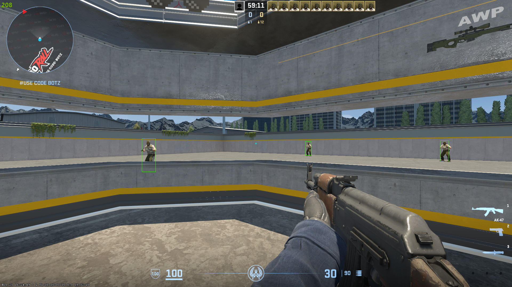

### Usage

1. **Compile the project**  
   - Install Visual Studio.  
   - Open the `.sln` file.  
   - Run the file or click on **Build** and select **Build Solution**.

2. **Run the program and adjust CS2 settings**  
   - Run the generated `.exe` file and launch CS2.  
   - Set the display mode to **Fullscreen Windowed** in the game settings.

---

**Note:** This is a minimal cs2 esp implementation in pure C, so beginners can use this as a starting point. It's not meant to be undetected since it uses a very simple method to read the games memory.
